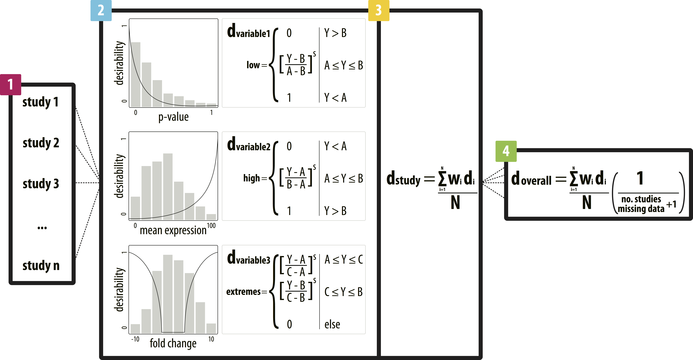

#integRATE: What is it?
---

integRATE is a desirability function-based framework for the integration of data.

Our method allows for the application of desirability functions to diverse, heterogeneous omics data and facilitates integration of results and ranking of candidate genes for further analysis. By applying desirability functions to key variables across many relevant studies, our method transforms all data to a common [0, 1] desirability scale. Previously heterogeneous data can then be straightforwardly integrated both within and between studies using an arithmetic mean, resulting in overall desirability scores for each gene that represent the weight of evidence from omics data for its involvement in the pathology of interest.

#integRATE: How do I use it?
---

### Installation from GitHub

1. install.packages("devtools")
2. devtools::install_github("eidemhr/integRATE")

### Methods

integRATE relies on four main steps to identify studies, integrate data, and rank candidate genes.

 

### Step 1: Study identification

First, relevant studies must be identified for integration based on any number of features including, but not limited to: phenotype, experimental design, and data availability.

### Step 2: Variable transformation

Data corresponding to all variables in each study are then transformed according to the appropriate desirability function. In this step, the user assigns a function based on whether low values are most desirable (dlow), high values are most desirable (dhigh), or extreme values are most desirable (dextreme) and can customize the shape of the function with other variables like cut points (A, B, C), scales (s), and weights (w) to better reflect the data distributions or to align with user opinion regarding data quality and relevance.

This step uses the desire_individual() function.

### Step 3: Variable integration

These variable-based scores are integrated (dstudy) with a straightforward arithmetic mean (where weights can also be applied) to produce a single desirability score for each gene in each study containing information from all variables simultaneously.

This step uses the desire_overall() function.

### Step 4: Study integration

Finally, study-based desirability scores are integrated to produce a single desirability score for each gene (doverall) that includes information from all variables in all studies and reflects its cumulative weight of evidence from each data set identified in step 1. These scores are normalized by the number of studies containing data for each gene and can be used to rank and prioritize candidate genes for follow up computational and, most importantly, functional analyses.

This step also uses the desire_overall() function.

#integRATE: Where can I learn more?
---

A paper describing integRATE and its application to preterm birth data is in the peer review process and will be linked here upon publication.

